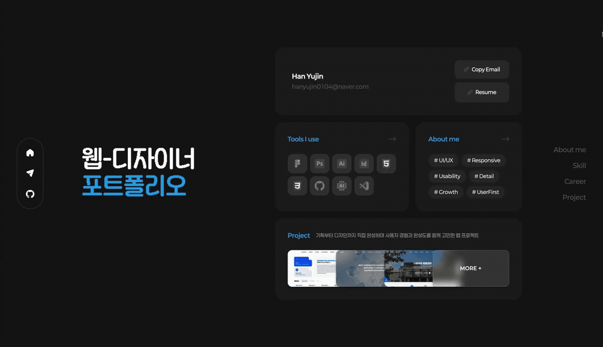

# Portfolio Yujin

> 커리어와 프로젝트, 스킬을 하나의 인터랙티브 경험으로 담아낸 웹 디자이너의 개인 포트폴리오 웹 서비스



[🔗 포트폴리오 바로가기](https://portfolio-yujin.vercel.app/)

## 🚀 프로젝트 소개

이력서만으로는 전달하기 어려운 디테일과 디자인 감각을 보여주기 위해 기획한 개인 포트폴리오입니다.
풀페이지 스냅 스크롤과 모션, 인터랙티브 모달을 결합해 방문자가 소개-스킬-커리어-프로젝트-컨택트로 이어지는 흐름을 하나의 경험으로 자연스럽게 따라가도록 설계했습니다.

## ⚙️ 주요 기능

- **홈**

  * 프로필·스킬·프로젝트 미리보기를 한눈에 볼 수 있는 대시보드형 위젯 구성
  * Framer Motion 기반 진입 애니메이션으로 첫 화면에 리듬감 부여

- **어바웃**

  * 디자인 철학과 자기소개를 질문·답변 형태로 담은 인트로 섹션
  * 스크롤 진행에 따라 질문이 순차적으로 전환되는 스크롤텔링 인터랙션

- **스킬**

  * 카테고리별 탭으로 보유 스킬을 분류해 탐색 편의성 확보
  * 아이콘 기반 카드 UI로 보유 기술을 직관적으로 시각화

- **커리어**

  * Education과 Work Experience를 구분한 카드형 경력 소개
  * 스크롤 위치에 반응하는 섹션 내비게이션으로 현재 보고 있는 위치를 명확히 인지

- **프로젝트**

  * Swiper 캐러셀로 다수의 프로젝트를 슬라이드 방식으로 탐색
  * 모달에서 화면 전환 없이 프로젝트 상세(작업 내용, 기여도, 스크린샷)를 확인

- **컨택트**

  * 이메일, 깃허브 링크 등 연락 수단 정리
  * Sonner 토스트로 복사 등 사용자 액션에 대한 즉각적인 피드백 제공

## 🎨 UI/UX 특징

- **풀페이지 스냅 스크롤**: 섹션 단위로 화면이 고정되어 넘어가는 인터랙션으로 프레젠테이션형 탐색 경험 제공
- **모션 중심 설계**: Framer Motion으로 스크롤·진입 시점에 맞춘 디테일한 모션 연출
- **모달 기반 정보 구조**: 프로젝트 상세 정보를 모달로 분리해 메인 흐름을 방해하지 않으면서 깊이 있는 정보 제공
- **반응형 레이아웃**: Sass 7-1 아키텍처 기반의 스타일 시스템으로 다양한 화면 크기에 일관되게 대응

## 🛠 기술 스택

**Frontend**

 
> 컴포넌트 기반 UI 설계와 빠른 개발 환경 구축

**Animation**


> 스크롤 트리거와 진입 애니메이션 등 정교한 모션 연출

**State Management**


> 활성 섹션, 모달 상태 등 전역 UI 상태를 간결하게 관리

**Styling**


> 7-1 패턴 아키텍처를 적용한 체계적인 스타일 관리

**UI Components**

  
> 터치 친화적 캐러셀과 아이콘 시스템, 토스트 피드백 구현

## 🧠 상태 관리

`Zustand` 기반의 단일 스토어(`useStore.js`)로 활성 섹션, 모달 오픈 여부 등 앱 전반의 UI 상태를 관리합니다.

## 📁 폴더 구조

```
src/
 ├─ assets/        # 정적 리소스 (이미지, 프리뷰 등)
 │   └─ styles/    # Sass 7-1 아키텍처 기반 스타일
 │       ├─ abstracts/  # 변수, 믹스인
 │       ├─ base/       # 리셋, 타이포그래피
 │       ├─ components/ # 컴포넌트별 스타일
 │       ├─ layout/     # 레이아웃 스타일
 │       └─ sections/   # 섹션별 스타일
 ├─ components/
 │   ├─ common/    # 재사용 공통 컴포넌트
 │   ├─ features/  # 기능 단위 컴포넌트
 │   ├─ layout/    # 레이아웃 컴포넌트 (Navigation, MainLayout 등)
 │   ├─ sections/  # Home, About, Skill, Career, Project, Contact 등 섹션 컴포넌트
 │   └─ ui/        # 버튼, 카드 등 UI 프리미티브
 ├─ data/          # 프로젝트/스킬/커리어 등 정적 데이터
 ├─ hooks/         # 커스텀 훅
 ├─ lib/           # 유틸리티 함수, 애니메이션 정의
 ├─ store/         # Zustand 전역 상태 관리 로직
 └─ styles/        # 공용 모션 variants
```
